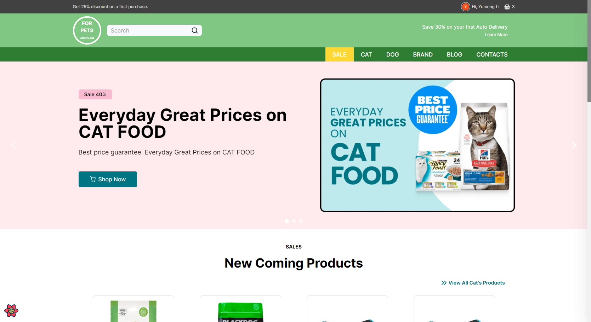
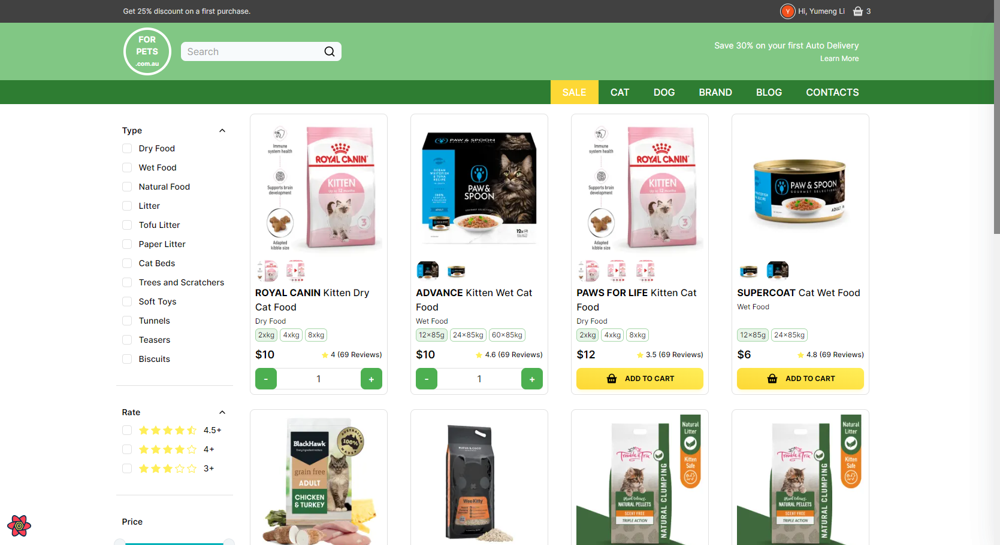
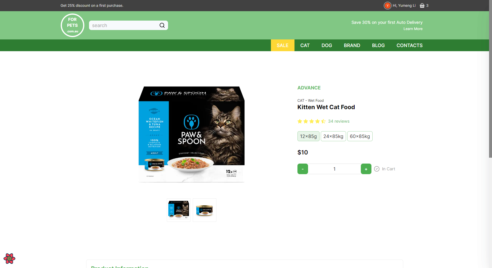
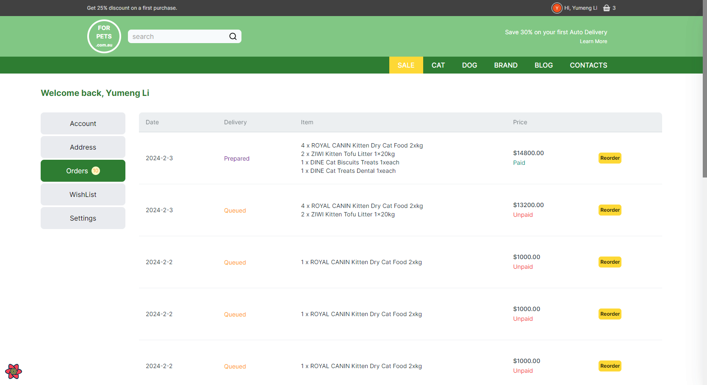
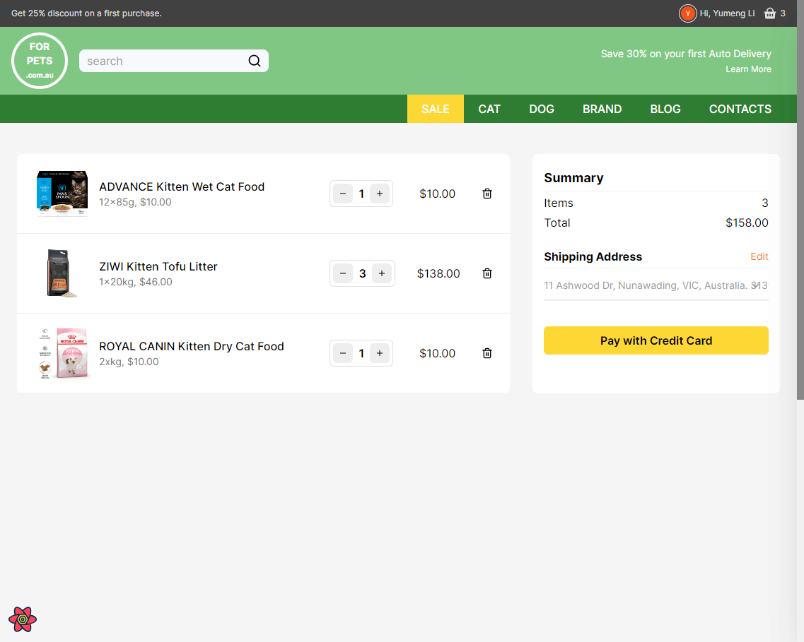

# ForPETS Store

Full-stack e-commerce built with [T3 Stack](https://create.t3.gg/)

- **Framework**: [Next.js](https://nextjs.org/)
- **State Management:** [Redux](https://redux.js.org/)
- **Database**: [PostgreSQL](https://www.postgresql.org/)
- **ORM**: [Prisma](https://prisma.io/)
- **Authentication**: [NextAuth.js](https://next-auth.js.org/)
- **Payment Gatewa**y: Stripie API
- **Deployment**: [Vercel](https://vercel.com)
- **Styling**: [Tailwind CSS](https://tailwindcss.com/)

This project is building for personal practice. It is a responsive e-commerce platform that allows users to browse and purchase products online, built with T3 Stack. A user-friendly shopping website with a list of products, filter by category & price & reviews, editable shopping cart.

[Live demo](https://forpet-ecommerce.vercel.app/)

### For Customer

- **User authentication:** customers can register, login, and manage their profile information, shipping addresses
- **Product browsing:** customers can browse products by category, filter by price and review rates for specific products
- **Shopping cart:** customers can add items to their cart, edit the quantity of items, and remove items from their cart
- **Checkout:** customers can securely checkout using Stripe API to process payments
- **Order management**: customers can view their order history and check the status of their current orders

### For Admin

More Functionality will be added with time

Home page



Products page



Product details



Dashbord



Purchase



## Environment Variables

To run this project, you will need to add the following environment variables to your `.env` file

```bash
# Database URL for prisma
DATABASE_URL=

# URL of the website
NEXTAUTH_URL='http://localhost:3000'

# Stripe
NEXT_PUBLIC_STRIPE_PUBLISHABLE_KEY=
STRIPE_SECRET_KEY=

# NextAuth
NEXTAUTH_SECRET=

# Google oAuth
GOOGLE_CLIENT_ID=YOUR_GOOGLE_CLIENT_ID
GOOGLE_CLIENT_SECRET=YOUR_GOOGLE_CLIENT_SECRET

```
